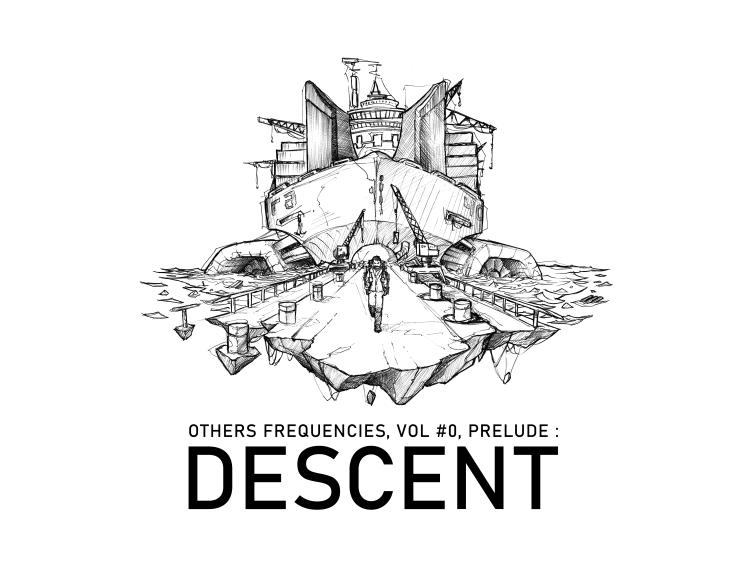
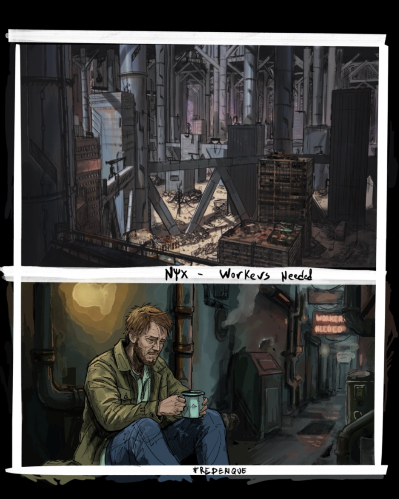
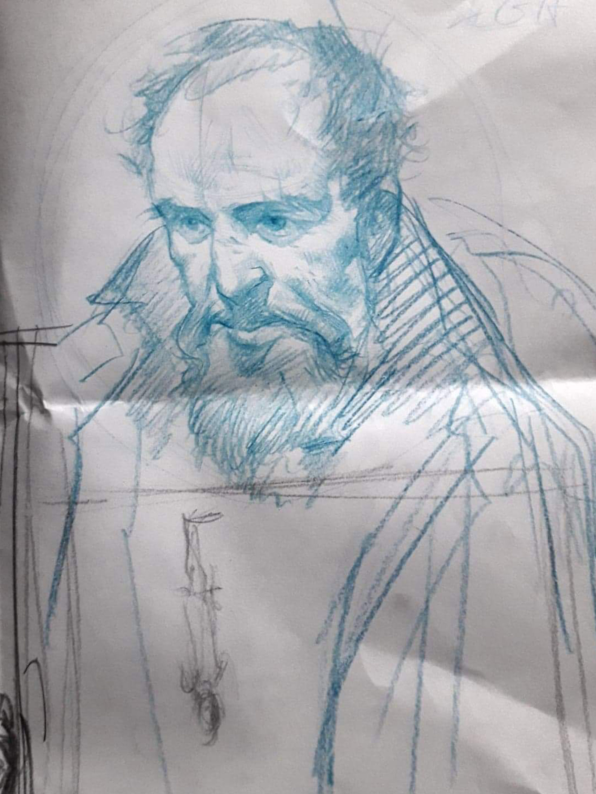
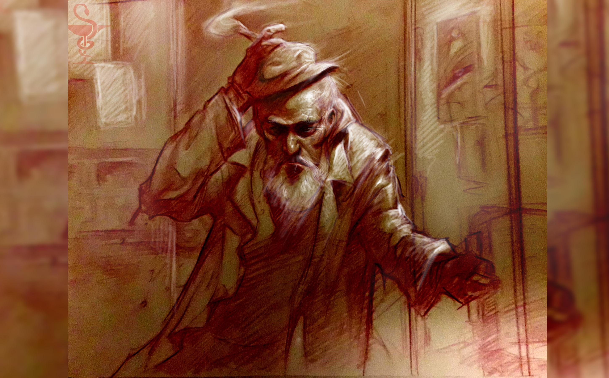
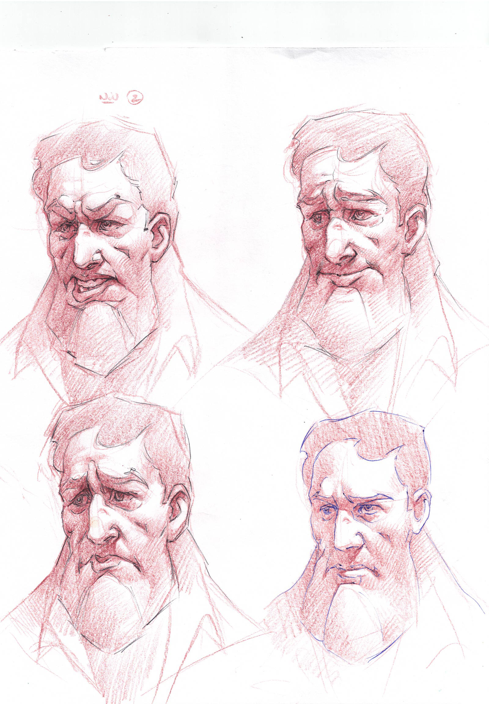
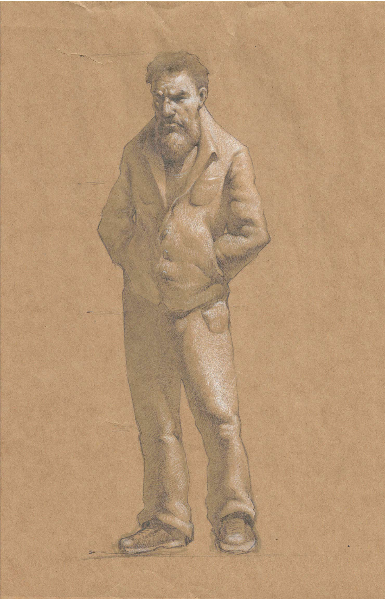
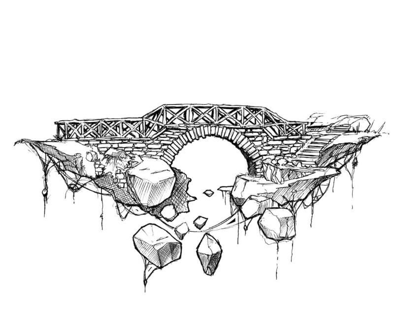

# Descent (Volume 0) — Other Frequencies

> *Descent (ou La Descente de Frédérique) est un projet de jeu vidéo narratif et systémique agissant comme le préambule (Volume 0) de l'univers étendu Other Frequencies. Conçu initialement comme une vitrine technologique du projet, ce titre explore les thématiques de la perception, de l'humilité et de la pression sociale au sein d'une dystopie industrielle.*

## 📑 Sommaire

* [🌌 Lore & Univers](#-lore--univers)
* [🎮 Vision Artistique & Spécifications](#-vision-artistique--spécifications)
* [⚙️ Mécaniques de Gameplay Systémiques](#️-mécaniques-de-gameplay-systémiques)
* [👥 L'Équipe Modelers](#-léquipe-modelers)
* [🚀 Prochaines Étapes (Roadmap)](#-prochaines-étapes-roadmap)

---

## 🌌 Lore & Univers

### La Cité de Nyx et le Complexe Léviathan

L'action se déroule dans le complexe **Léviathan**, une structure industrielle massive née d'un projet international de compression des déchets océaniques. Au fil des décennies, cette plateforme est devenue la métropole de **Nyx**, une ville verticale et oppressive où le recyclage et la "bricole" sont les seuls moyens de survie.

* **Structure Verticale :** De la "Haute Ville" aseptisée aux "Bas Fonds" toxiques, Nyx enferme ses habitants dans un cycle social tournant en boucle.
* **L'Ombilic :** Un câble de maintien essentiel reliant la ville, véritable symbole du lien ténu avec le monde extérieur.
* **Atmosphère :** Un univers « gris, salé et humide » où la technologie oscille entre le Low-tech (matériaux recyclés) et la haute technologie contrôlée par l'OFI (*Other Frequencies Institute*).
* **Mycélium :** Un champignon développé par l'OFI, reprogrammé à l'aide de réseaux de neurones pour pouvoir digérer et recompacter les déchets.

### La Théorie de l'Ombre

L'univers de *Descent* repose sur une physique alternative. Ici, la gravité n'est pas une force d'attraction, mais une pression exercée par le vide. Selon cette théorie, la "chute" est simplement le vide cherchant à se combler — une métaphore directe de la trajectoire du protagoniste.

### Le Récit : La Descente de Frédérique

Le joueur incarne **Frédérique (Fred)**. Son ambition initiale de faire fortune se transforme progressivement en une quête d'humilité. À la suite d'un pacte avec son ami Jean, Fred choisit de devenir un "gardien invisible" dans les bas-fonds, perdant peu à peu son ego et ses possessions matérielles pour atteindre une forme de paix intérieure.

---

## 🎮 Vision Artistique & Spécifications

| Caractéristique | Détail |
| :--- | :--- |
| **Genre** | Top-Down RPG (Jeu de rôle en vue de dessus), Infiltration, Simulation immersive |
| **Moteur** | Godot Engine (GDScript) |
| **Durée estimée** | Environ 3 à 4 heures de jeu |
| **Inspirations** | Morgann Andrieux et David Chardon |

**Style Visuel :**
Le jeu utilise une esthétique assumée de "produit en cours d'élaboration". Les environnements intègrent des croquis, des lignes de construction visibles, et proposent une évolution colorimétrique intimement liée à la progression narrative du joueur.

---

## ⚙️ Mécaniques de Gameplay Systémiques

Le projet se distingue par des mécaniques de jeu (systems design) qui servent directement et viscéralement le propos narratif :

### 🧠 Système de Mémoire FIFO

Le jeu s'affranchit de l'inventaire classique pour le remplacer par une "mémoire tampon" très limitée (3 à 6 slots maximum).

* **Logique de file d'attente :** Premier entré, premier sorti (*First In, First Out*). Interagir avec un nouvel objet peut définitivement chasser le plus ancien de votre esprit.
  l'objectif derriére est de mettre en avant: L'ouverture d'esprit de plus en plus grande, et le deficit de l'attention dont souffre le personnage principal.
* **Énigmes :** Les "Portes Séquentielles" ne s'ouvrent que si le joueur possède une combinaison spécifique d'objets, stockée dans un ordre précis en mémoire. La méchanique du jeux à pour objectif de perturber la résolution
* de ces énigmes en venant rajouter des éléments venant perturber la mémoire du personnage. 

### 👁️ Système de Vision "Color Cloud"

Un nuage de particules géré par *shader* simule le champ de vision et l'anticipation spatiale du personnage. Le système calcule la position cible du nuage ($P_{target}$) selon la formule mathématique suivante :

$$P_{target}=P_{current}+(V_{smoothed}\times F_{anticipation})+(I_{smoothed}\times F_{intent})$$

*Note technique : Le nuage réagit physiquement aux obstacles via un système de Raycasting, ce qui garantit qu'il ne traverse jamais les murs de l'environnement.*

### 🎒 La Dépossession (La Révélation)

À un moment clé du récit narratif, le joueur est contraint de se déposséder de l'intégralité de ses biens. Ce dépouillement radical modifie la perception du monde et débloque de nouveaux passages (conduits de déchets, caves) qui étaient physiquement inaccessibles auparavant.

---

## 👥 L'Équipe Modelers

Le projet est fièrement porté par le collectif **Modelers**, un studio collaboratif visant à accompagner les talents artistiques et à transmettre des compétences en arts narratifs.

* **Scénario :** Antoine, Amaury et David
* **Assets Graphiques :** Amaury et David
* **Concept Art :** David et Morgann
* **Développement Godot :** David
* **Musique :** Johann 

---

## 🚀 Prochaines Étapes (Roadmap)

- [ ] Finalisation des systèmes d'interaction avec l'environnement
- [ ] Expansion des quartiers de la "Ville Basse"
- [ ] Transition vers le Volume 1 : *Other Frequencies*

---

## 🎨 Concept Art & Recherches Visuelles

Voici un aperçu des recherches graphiques, concepts et structures qui ont servi à bâtir l'univers visuel de *Descent* et de la cité de Nyx.

### Personnages (Frédérique)

### Environnements et Structures (Nyx & Léviathan)

.png)
.png)
.png)

> *Ce document a été généré pour présenter la documentation technique et narrative du projet Descent.*
